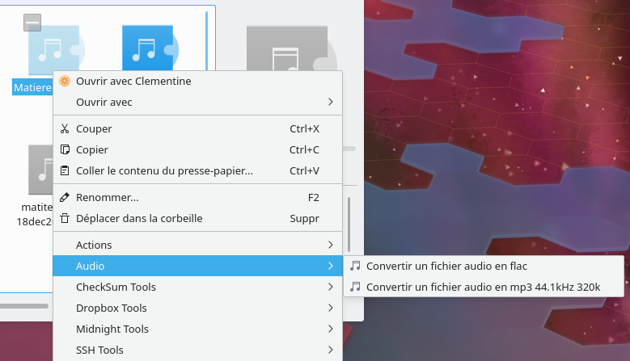

# AudioConverterMenu
A dolphin menu to convert files to flac or to mp3 high quality.

## Usage

Use right-clic on a multimedia file, and enter in the **Audio** submenu:

## Installation

Use `kf5-config --path services` to find your kservice directory. A commonly used directory is `$HOME/.local/share/kservices5/`

Add `audioConverterMenu.desktop` file in your kservice directory. It will add a new "Audio" entry in the right-clic menu.
